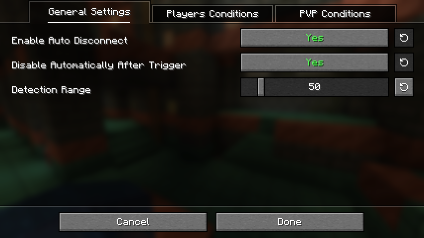
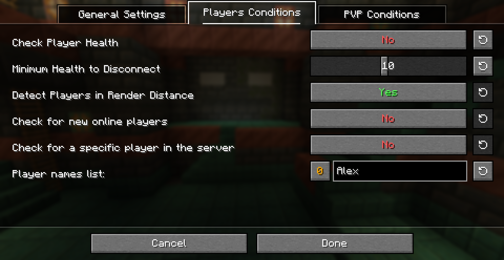
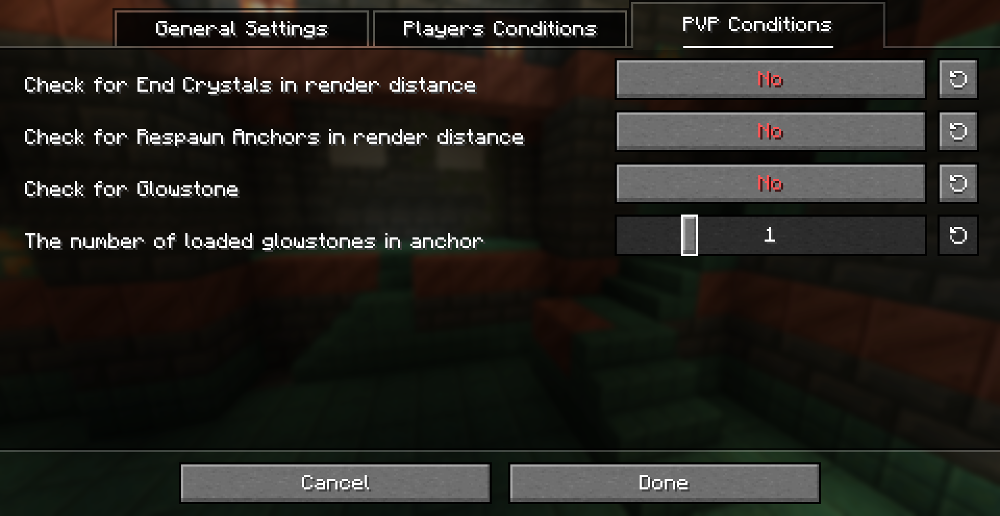
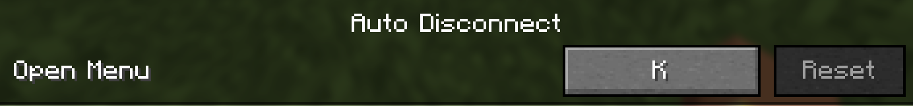
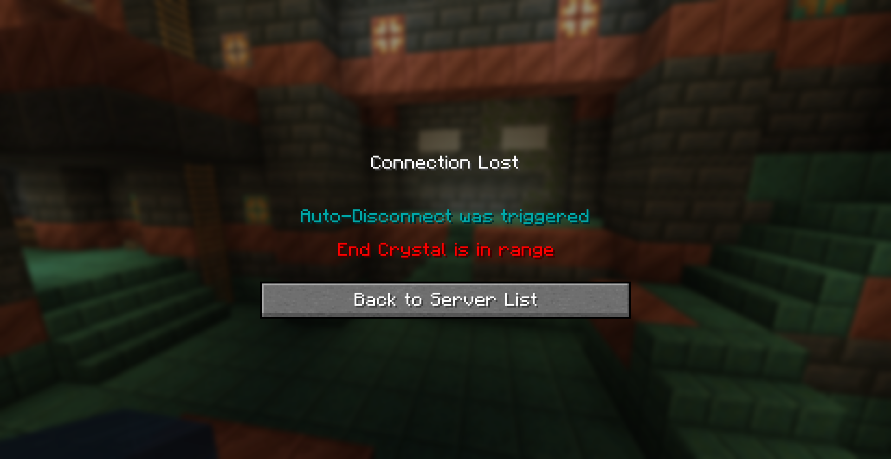

# Auto Disconnect Mod By I-No-oNe
-----------------
```yml
How to use?
# Install the mod latest version and install midnightLib.
# Press the keybind K on your keyboard to open the GUI.
# Set the conditions for the auto disconnect.
# Turn on/off the settings as you want.
```
-----------------------------------
## Showcase:
### GUI
- ***First Page:***

- ***Second Page:***

- ***Third Page:***

----------
### Setting The Keybind

--------------------
### In-game Example:

-----------------

**BE AWARE THAT YOU MUST TO DOWNLOAD THE [**Midnight-LIB**](https://modrinth.com/mod/midnightlib) LIBRARY IN ORDER TO THE MOD TO WORK!**

------------------
**tysm for using this mod** 🙏
